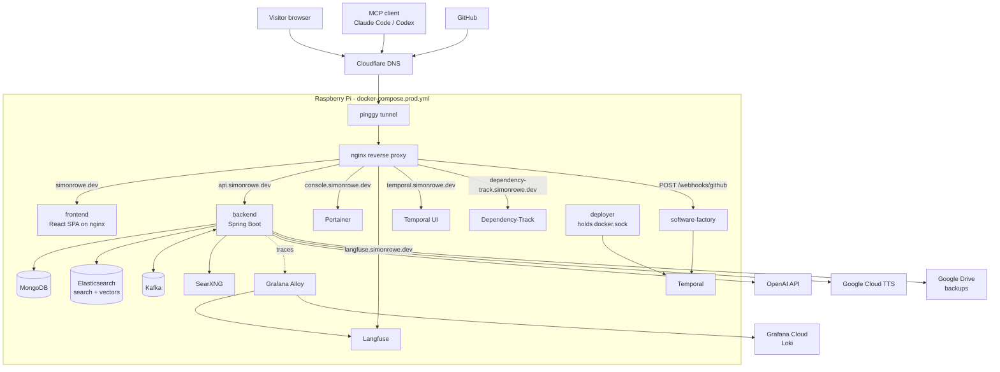
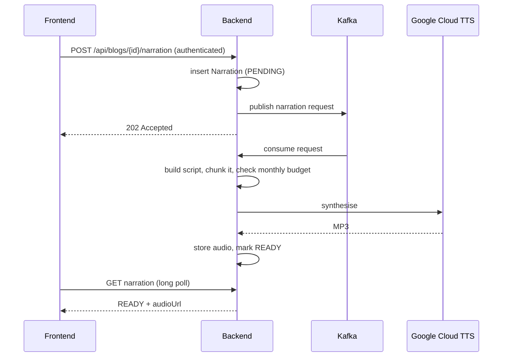

# Architecture

How simonrowe.dev is put together: the deployables, the data stores, the request
paths, and the asynchronous flows. Operational detail lives in the
[runbooks](runbooks/); this document is the map you read first.

For the software factory — the self-hosted agents that review, patch and deploy
this repository — see [software-factory.md](software-factory.md).

## The whole system



Ingress is deliberately indirect: the Pi has no public IP and no open ports.
Cloudflare fronts `*.simonrowe.dev`, a [pinggy](https://pinggy.io) tunnel
carries traffic to the `nginx` container, and nginx is the only thing that knows
about the services behind it. Portainer publishes no host port at all — it is
reachable *only* through nginx.

## Deployables

| Image | Source | What it is |
|-------|--------|------------|
| `…-backend` | `backend/` | Spring Boot API, agents, chat, MCP server, admin API |
| `…-frontend` | `frontend/` + `Dockerfile.frontend` | React SPA built by Vite, served by nginx |
| `…-software-factory` | `software-factory/` + `Dockerfile.software-factory` | Webhook receiver + Temporal workers; runs twice in prod (`software-factory`, `deployer`) |

All three are published to `ghcr.io/simonjamesrowe/simonrowe-dev-monorepo-*` by
the `Publish` workflow on merge to `main`. The Pi pulls; nothing is pushed to it.

## Backend

One Spring Boot application, organised by domain package under
`com.simonrowe`. There is no module boundary enforced by the build — the
packages are the boundary.

| Package | Responsibility |
|---------|----------------|
| `profile`, `employment`, `skills`, `resume` | CV content: profile, jobs, skill groups, generated PDF résumé |
| `blog`, `media`, `code` | Blog posts, uploaded assets and thumbnails, code examples |
| `aggregation`, `agents` | Content aggregation — scrapers (`RssScraper`, `SitemapHtmlScraper`, `LumaApiScraper`, `LinkRoundupScraper`), classification, weekly digest |
| `events`, `favourites`, `summary` | News/events listings, per-user favourites, on-demand AI article summaries |
| `narration` | Text-to-speech narration of blogs and article summaries (Google Cloud TTS) |
| `chat`, `embedding`, `search`, `websearch`, `webfetch` | The site chatbot: RAG over Elasticsearch vectors, SearXNG web search, URL fetching |
| `mcp` | MCP server exposing the site's tools to external agents |
| `tour`, `contact` | Guided site tour, contact form (reCAPTCHA + mail) |
| `admin`, `dataops`, `migration` | Admin CMS API, backup/restore/re-embed operations, Mongock change units |
| `auth`, `ratelimit`, `observability`, `common` | Auth0 resource-server config, Bucket4j rate limits, Langfuse/OTel plumbing |

### HTTP surface

Public read APIs sit under `/api/*` (`profile`, `jobs`, `skills`, `blogs`,
`news`, `events`, `search`, `code-examples`, `tour`, `resume`, `narrations`).
Everything under `/api/admin/*` requires an Auth0 JWT, as do the endpoints that
spend money on a model — `POST` for summaries and narration. Chat runs over a
STOMP WebSocket at `/ws/chat`, and the MCP server answers Streamable-HTTP
JSON-RPC at `/mcp`. Uploaded media is served from `/uploads/**`.

### Data stores

- **MongoDB** — the system of record for all content. Indexes are created by
  Mongock change units in `com.simonrowe.migration`; automatic index creation
  is off, so `@CompoundIndex` alone does nothing.
- **Elasticsearch** — full-text site search and the Spring AI vector store used
  by chat retrieval.
- **Kafka** — asynchronous work: `content-changes` plus the narration and
  summary request topics.

### Asynchronous narration

The one flow worth a diagram, because it spans Kafka, an external API and a
polling frontend:



`GET /api/narrations/ready?contentType=…` returns every ready narration in one
call so listing pages can render play buttons without one request per card —
per-card polling would trip the rate limiter on first render.

## Frontend

A single Vite-built React 19 SPA. `HomePage` stays in the initial bundle;
every other route is lazily code-split, which keeps the MDXEditor (admin),
`react-syntax-highlighter` and `mermaid` (blog detail) stacks out of first paint.

```text
frontend/src/
  pages/           Route components — public pages and pages/admin/*
  components/      Feature components: chat, narration, experience, tour, admin, layout
  contexts/        ChatContext, ThemeContext (light/dark)
  hooks/           Data-fetching and UI hooks (useProfile, useDrawer, useNarration, …)
  auth/            Auth0 provider and gates
  services/        API clients
  styles.css       All styling: plain CSS, BEM, custom properties for theming
```

Public routes: `/`, `/profile`, `/experience`, `/blogs`, `/blogs/:id`,
`/news-events`, `/mcp`. The admin CMS lives under `/admin/*` behind Auth0 and
covers blogs, jobs, skills, tags, profile, media, code examples, tour steps,
aggregated content, content sources and data operations.

## Local vs production topology

`docker-compose.yml` runs **infrastructure only** — MongoDB, Kafka,
Elasticsearch, Temporal, Langfuse and Grafana Alloy. The backend and frontend
run on the host (`./scripts/start.sh`), so you get fast reloads and a debugger.

`docker-compose.prod.yml` runs everything as containers, plus the pieces that
only exist in production: `nginx`, `pinggy`, `portainer`, `searxng`,
`software-factory`, `deployer`, `temporal-ui` and Dependency-Track.

Notable production behaviours, each with a runbook:

- A cron watchdog (`scripts/monitor-prod.sh`) reconciles the stack every minute
  — Docker never restarts a merely *unhealthy* container on its own. See
  [prod-monitoring.md](runbooks/prod-monitoring.md).
- A merge to `main` deploys itself via the `deployer` container. See
  [deploy.md](runbooks/deploy.md).
- nginx serves themed maintenance pages during a deploy, driven by a flag file
  in a shared volume.
