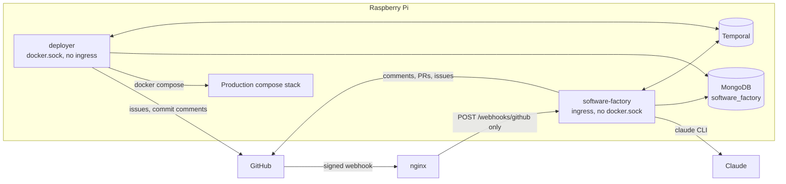
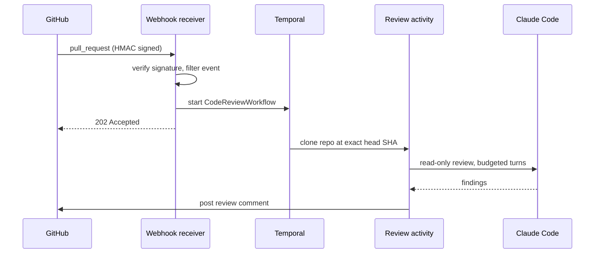
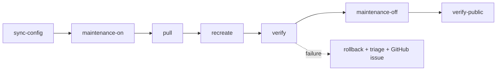

# Software Factory

`software-factory/` is a Spring Boot service that runs coding agents against
*this* repository — reviewing pull requests, patching CVEs, deploying merges and
harvesting review feedback into guidance. It is a modular monolith: one JVM, four
modules, each owning a Temporal task queue.

This document is the architectural map. Operating it is covered by
[runbooks/software-factory.md](runbooks/software-factory.md); the original design
rationale for the code-review module is in
[temporal-code-reviewer.md](temporal-code-reviewer.md).

## Shape

Two containers run the **same image**. What separates them is configuration, not
code:



`software-factory` terminates untrusted internet traffic and therefore must not
hold the Docker socket. `deployer` holds the socket and a read-write mount of the
deploy directory, and has no ingress at all. Both register *workflow* pollers on
every queue — classpath scanning is unconditional — but only `deployer` has an
implementation of the side-effecting deploy activities, gated by
`@ConditionalOnProperty(factory.deploy.enabled)`. That single annotation is what
confines the socket.

Every agent run is a Temporal activity shelling out to a pinned Claude Code
binary baked into the image, in a fresh git workspace, with an explicit turn,
timeout and tool budget.

## The four modules

| Module | Queue | Trigger | Output | Runbook |
|--------|-------|---------|--------|---------|
| `codereview` | `code-review` | PR opened/synchronised webhook | Review comment on the PR | [software-factory.md](runbooks/software-factory.md) |
| `feedback` | `review-feedback` | PR merged, or `POST /api/feedback` | PR against `simonjamesrowe/agent-setup` adding distilled guidance | [software-factory.md](runbooks/software-factory.md) |
| `cvefix` | `cve-fix` | Daily Temporal schedule (`cve-fix-daily`) | PR bumping vulnerable dependencies, driven to green CI | [cvefix.md](runbooks/cvefix.md) |
| `deploy` | `deploy` | `Publish` workflow succeeded on `main` | Production deploy, or rollback + issue | [deploy.md](runbooks/deploy.md) |

Three of the four are **off by default** (`FACTORY_FEEDBACK_ENABLED`,
`FACTORY_CVEFIX_ENABLED`, `FACTORY_DEPLOY_ENABLED` /
`FACTORY_DEPLOY_TRIGGER_ENABLED`). Merging a change to any of them does nothing
until an operator opts in.

### Code review



The workflow reviews an exact commit SHA and is read-only: it does not push, fix,
approve, block merges, or touch other repositories. Guards refuse changes that
are pointless to review (over 250 changed files or 2 MiB of diff) rather than
truncating them silently.

### Feedback loop

A merged PR's review conversation is harvested, distilled into durable "lessons",
and proposed as a pull request against the `agent-setup` repository — so guidance
that came out of a human correction ends up in the instructions future agents
read. Harvest runs on a cheap model, distillation on a stronger one.

### CVE fix

A daily schedule reads findings from Dependency-Track (over the internal compose
network, never the public hostname), asks the agent to bump the affected
dependency, opens a PR, then **polls CI** and re-runs the agent up to a repair
budget. The agent has no `Bash` tool and the image carries no Gradle, Node or
Docker — CI is deliberately the only build environment.

### Deploy

A merge to `main` deploys itself. The `Publish` workflow succeeding sends a
`workflow_run` webhook, which signals a Temporal workflow on the fixed id
`deploy-prod` carrying the head SHA. `deployer` then runs phases of
`scripts/restart-prod.sh`:



`sync-config` decides which services a compose change affects *before* moving
`HEAD`, so the deploy directory never ends up ahead of what is running. On
failure the previous images are restored and a `Bash`-less Claude triage writes
up what happened on a GitHub issue and a commit comment.

**The `deployer` never recreates itself.** After any merge touching
`software-factory/`, update it by hand:

```bash
docker compose -f docker-compose.prod.yml up -d --no-deps deployer
```

## Running it locally

```bash
docker compose up -d temporal
./gradlew :software-factory:bootRun
```

- Webhook + internal API: <http://localhost:8090>
- Health: <http://localhost:8091/actuator/health>
- Temporal UI: <http://localhost:8233>

Only `POST /webhooks/github` is routed by nginx in production, with an
exact-match `location =`. The internal `/api/reviews` and `/api/feedback`
endpoints are unrouted *and* token-protected.

## Things that bite

- **A healthy container is not a working factory.** `software-factory` can be
  `healthy` with no Temporal poller registered: webhooks return `202` and nothing
  ever reviews. Check pollers on the task queue, not the healthcheck.
- **Some setup can only be done by a human** with GitHub org admin — installing
  the App, granting permissions, subscribing to `workflow_run`. Those are
  tracked in
  [software-factory-manual-actions.md](runbooks/software-factory-manual-actions.md).
- When a PR gets no review comment at all, start from the
  `code-review-triage` skill rather than guessing.
