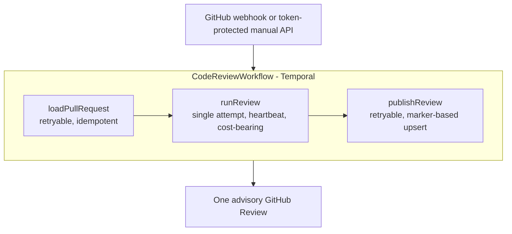

# Design note: the Temporal code reviewer

Why the `codereview` module is shaped the way it is. This is a decision record,
not a runbook — it explains choices that are cheap to re-litigate badly and
expensive to reverse.

- Architectural map of all four modules: [software-factory.md](software-factory.md)
- Operating it: [runbooks/software-factory.md](runbooks/software-factory.md)
- Things only a human can do: [runbooks/software-factory-manual-actions.md](runbooks/software-factory-manual-actions.md)

`codereview` was the first module of the software factory, and for a while the
only one. It is now one of four (`codereview`, `feedback`, `cvefix`, `deploy`)
sharing a JVM, an image and a Mongo database. What it still does *not* do, by
design: fix code, create branches, approve or block merges, manage downstream
repositories, or run a panel of specialist agents.

## Why this shape

Temporal owns durable control flow. A provider-neutral `ReviewEngine` owns one
code-aware review attempt. GitHub and the agent runner are Activities, so no
network, filesystem, process or model call happens inside deterministic Workflow
code.



The full diff stays in a disposable checkout rather than Temporal Event History.
Only compact request metadata, progress and the structured report cross Activity
boundaries. Duplicate GitHub deliveries for the same `owner/repo/PR/head SHA`
resolve to the same Workflow ID.

**`runReview` gets one attempt.** Temporal will not blindly repeat a cost-bearing
model run after an ambiguous timeout. Everything either side of it is retryable
because it is idempotent.

## Agent choice

The adapter calls Claude Code's headless CLI from Java — the lightest path that
keeps Claude's code-navigation loop without standing up a second service. The
invocation is deliberately hostile to its own input:

- validated JSON-schema output;
- loads no repository settings, `CLAUDE.md`, skills, plugins, hooks or MCP;
- exposes only `Read`, `Glob` and `Grep` — no `Bash`, no `Write`;
- runs in `dontAsk` mode, so anything not explicitly allowed is denied;
- strips unrelated token/secret/password environment variables before spawning;
- excludes common credential files from the model-visible diff and checkout;
- removes repository symlinks first, so a relative read cannot escape;
- discards findings outside changed files;
- normalises the verdict deterministically from accepted findings.

The service runs as a non-root user (uid/gid 10003) in the container, with the
Claude binary root-owned at 0755 so it can be executed but not replaced.

**Do not use an interactive consumer Claude login as an unattended service
credential.** Production uses a supported API credential.

### Why `ReviewEngine` is the boundary that matters

A later worker could implement it with the Claude Agent SDK in a separately
isolated process, Embabel for typed provider-neutral planning, Spring AI, or a
local model. Nothing above that interface knows which.

Embabel is not in the review path because Temporal already provides
workflow/state/retry and Claude already provides the code-agent harness — putting
Embabel between them would duplicate orchestration. It earns its place when the
factory needs dynamic typed planning across reusable business actions, multiple
model providers, or non-code agents. (The website backend *does* use Embabel, for
content aggregation and digests; this is a statement about the review path only.)

## What gets published

A GitHub Review submitted with a `COMMENT` event: one inline comment per finding
anchored to the diff, with a body fallback when a finding cannot be anchored
(GitHub returns 422). The upsert marker lives in the review body rather than a
separate issue comment, so a re-review replaces rather than accumulates.

Reviews are **advisory**. Nothing here is a required status check.

## Limits, and why they are where they are

| Limit | Value | Reasoning |
| --- | --- | --- |
| Changed files | 250 | 80 refused ordinary spec-driven PRs outright. This still catches the cases the guard exists for — a regenerated lockfile, a vendored directory, a mass rename |
| Diff size | 2 MiB | The tighter guard in practice. Raising it needs a plan for chunking the diff, not just a bigger number |
| Agent turns | 60 | Turns, not wall clock, are what actually bound review cost. Raising the file ceiling without raising this just moves truncation from an explicit refusal to silent turn exhaustion |
| Agent timeout | 25m | Must stay comfortably below the Activity's start-to-close timeout, which also covers clone, checkout and diff |

All four are `FACTORY_*` environment overrides; current values live in
`software-factory/src/main/resources/application.yml`, which carries the full
reasoning inline.

## The single-process trade

The webhook receiver and the Temporal worker are one JVM. That was not always so:
the worker previously ran as a systemd service on the host, keeping the
internet-facing container free of Claude and GitHub App credentials.

They were merged for two reasons — to fit one Raspberry Pi, and to stop the
worker being a host service that no `docker compose up` ever reconciled, which is
exactly how it once sat dead for a day while webhooks were still being accepted.

**What that gave up:** the process terminating untrusted internet traffic now also
holds long-lived credentials.

**What makes it defensible:** the exposed surface is a single exact-match route
whose signature check is tested; the agent runs read-only inside a container
rather than on the host; and the container declares no `env_file`, receiving only
the variables named in its Compose `environment:` block, with
`ClaudeCliReviewEngine` stripping everything outside
`SAFE_SECRET_ENVIRONMENT`/`PROCESS_ENVIRONMENT` before spawning Claude. A
prompt-injection payload in a pull request cannot read unrelated secrets.

Cloning contributor branches into a container is *stricter* isolation than the
host service had, which offsets part of what the merge cost.

The same reasoning is why the `deploy` module runs in a **separate container**
(`deployer`) with the Docker socket and no ingress: the trade above is acceptable
for a read-only agent and is not acceptable for one that can mutate the host.

## Ingress and credentials

Public ingress is exactly `POST /webhooks/github`, routed by nginx with an
exact-match `location =`. The manual trigger (`/api/reviews`) and the feedback
endpoints stay unrouted *and* token-protected by `FACTORY_TRIGGER_TOKEN`.
Management ports and Temporal's gRPC port (7233) are never exposed.

The webhook handles `opened`, `reopened`, `synchronize` and `ready_for_review`,
skips drafts, and verifies `X-Hub-Signature-256` against the exact request body.
`closed` is routed to the feedback module instead.

Authentication is an organization-owned GitHub App, not a personal access token.
The App webhook payload carries an installation ID; `GitHubCredentials` exchanges
it for a repository-scoped installation token and caches it until five minutes
before expiry. The private key and token exist only inside GitHub and checkout
Activities — neither enters Workflow inputs, Event History, prompts, nor the
Claude environment. `GITHUB_TOKEN` remains an optional local-development bridge.

Required App configuration is listed in
[runbooks/software-factory-manual-actions.md](runbooks/software-factory-manual-actions.md);
permission changes are the one thing a deploy cannot do for you.

### Temporal UI

Exposed at `https://temporal.simonrowe.dev` behind Auth0 OIDC, which Temporal UI
supports directly — no OAuth proxy needed. Two decisions worth keeping:

- **It uses a dedicated Auth0 application, not the public portfolio client.**
  Authentication without an application-level access restriction would let any
  visitor account in the tenant read workflow inputs and results.
- **`TEMPORAL_DISABLE_WRITE_ACTIONS: "true"`.** UI login protects the browser
  route; it is not authorization on the underlying Temporal API. Mutations stay
  off until Temporal Server authorization is configured.

Configuration lives in `docker-compose.prod.yml` and
`config/nginx/nginx-proxy.conf`; it is not duplicated here, because a copy in a
document is a copy that drifts.

## Running it locally

```bash
docker compose up -d temporal
./gradlew :software-factory:bootRun
```

The Compose service is the official all-in-one development image with a
named-volume SQLite database and UI — fine for development and CI, not the
production topology, which uses pinned `temporalio/server` with `temporal` and
`temporal_visibility` schemas in Postgres.

Trigger a review without publishing:

```bash
curl -X POST http://localhost:8090/api/reviews \
  -H "Content-Type: application/json" \
  -H "X-Reviewer-Token: ${FACTORY_TRIGGER_TOKEN}" \
  -d '{"owner":"simonjamesrowe","repository":"simonrowe-dev-monorepo",
       "pullNumber":1,"expectedHeadSha":"","publish":false}'
```

The response carries a `workflowId`; query it at
`GET http://localhost:8090/api/reviews/{workflowId}`. For public repositories and
an unpublished review, `GITHUB_TOKEN` can be empty — publishing and private
clones require it.

## The factory roadmap, and where it actually got to

The original plan was to build the harness before adding autonomy:

1. **Review station** — *built.* Immutable input, exact-SHA checkout, structured
   output, evidence filtering, observable workflow.
2. **Evaluation station** — *partial.* Promptfoo evals exist for the website
   chatbot (`evals/`), and the `feedback` module distils merged-PR review
   conversations into durable guidance. There is still no golden-PR fixture set,
   false-positive labelling, or prompt/model version ledger for review itself.
3. **Verification station** — *externalised to CI.* Rather than the factory owning
   `test`/`checkstyle`/lint/build, `cvefix` polls GitHub Actions and treats CI as
   the only build environment. The agent has no `Bash` tool and the image carries
   no Gradle, Node or Docker. Cheaper, and it keeps the build honest.
4. **Planning/build station** — *partial.* `cvefix` plans a dependency bump,
   patches in an isolated workspace, opens a PR and iterates against CI within a
   repair budget. It is narrow by choice; general planning is not built.
5. **Factory graph** — *not built.* Today there are four task queues on two
   containers, not a general capability graph with policy gates and artifact
   storage. `deploy` added the first genuinely host-mutating station, which is why
   it got its own container rather than another queue in the same JVM.

The invariant has held throughout, and is the thing to defend: **agents propose or
assess; deterministic code owns permissions, state transitions, evidence, budgets
and completion.**

At higher scale the split is by capability, not by module — separate Task Queues
for `code-review-claude`, `code-review-embabel`, `verify-java`, `verify-frontend`
and so on, each with its own image, permissions, concurrency, model credentials
and hardware. One Pi has not needed that.
